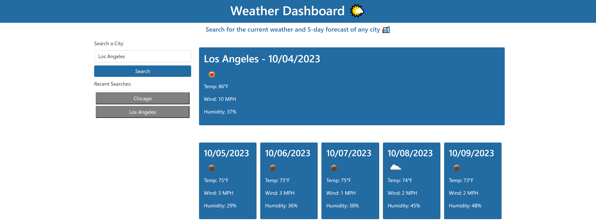

# Weather Dashboard

This repo is for module six's challenge assignment.

## Description

The challenge is an Job-seeking coding assessment or take-home assignment (no starter code is provided, we will build this web application by scratch). The goal is to create an application of a weather dashboard and it will run in the browser. This app will run in the browser and will feature dynamically updated HTML and CSS powered by JavaScript code and the use of Web APIs. It will have a clean, polished, and responsive user interface. It will use a 5 Day Weather Forecast API to retrieve data for cities. LocalStorage will be used to store any persistent data.

The motivation behind this project was to learn how to utilize all the previous skills we have learned as well as the utilization of Web APIs we've been learning. I built this project in order to hone my own skills in HTML, CSS, Git, JavaScript and Web APIs. The problem it solved is to create a weather dashboard to work on the coding skills I've learned in the bootcamp thus far.

## User Story

```
AS A traveler
I WANT to see the weather outlook for multiple cities
SO THAT I can plan a trip accordingly
```

## Acceptance Criteria

```
GIVEN a weather dashboard with form inputs
WHEN I search for a city
THEN I am presented with current and future conditions for that city and that city is added to the search history
WHEN I view current weather conditions for that city
THEN I am presented with the city name, the date, an icon representation of weather conditions, the temperature, the humidity, and the the wind speed
WHEN I view future weather conditions for that city
THEN I am presented with a 5-day forecast that displays the date, an icon representation of weather conditions, the temperature, the wind speed, and the humidity
WHEN I click on a city in the search history
THEN I am again presented with current and future conditions for that city
```

## Accessing the Repo or Webpage:

- GitHub Repo URL: https://github.com/kevindimayuga/weather-dashboard-kd
- GitHub Pages WebPage Deployment URL: https://kevindimayuga.github.io/weather-dashboard-kd/

## Webpage Screenshot



## Table of Contents

- [Installation](#installation)
- [Usage](#usage)
- [Credits](#credits)
- [License](#license)

## Installation

The following steps were taken to complete the project:
- Review the purpose of the project, the user story and acceptance criteria
- Review the basics to starting a web application
- Review semantic HTML elements and structure
- Review CSS and advanced CSS
- Review JavaScript
- Review Web APIs
- Review code accessibility standards
- Create Professional README file
- Add website image/gif to README file
- Deploy website to GitHub Pages
- Submit URLs to deployed webpage and GitHub Repo

HTML Updates
```
<!-- comments were made as needed in the HTML file -->
```

CSS Updates
```
/* comments were made as needed in the CSS file */
```

JavaScript Updates
```
// comments were made as needed in the JavaScript file
```

Web APIs Updates
```
// comments were made as needed in the HTML and JavaScript file
```

## Usage

- Go to the Weather Dashboard application
- Use the search bar section to search by city name and click 'Search'
- When you search for the city, data on city name, the current date, weather conditions, temperature, humidity and wind speed are pulled up on the page
- A 5 Day Weather Forecast will also display with the same information over the next five days
- City is added to the search history
- LocalStorage will store persistent data of previously searched cities
- Click on past searched city buttons to pull up the weather and conditions for that city again if user would like to access that data again

## Credits

I used the following resources to help guide me to complete the portfolio project:

- [MDN](https://developer.mozilla.org/en-US/)
- [W3Schools](https://www.w3schools.com/)
- [JavaScript Tutorial](https://www.w3schools.com/js/)
- [Web APIs - Introduction](https://www.w3schools.com/js/js_api_intro.asp)
- [How to Use API Keys](https://coding-boot-camp.github.io/full-stack/apis/how-to-use-api-keys)
- [momentjs](https://momentjs.com/)
- [How to take a full page screenshot with a hidden Chrome shortcut](https://zapier.com/blog/full-page-screenshots-in-chrome/)

## License

N/A

## Badges

N/A

## Features

N/A

## How to Contribute

N/A

## Tests

N/A